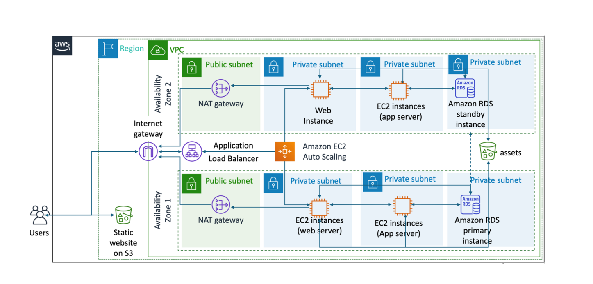

# AWS Infrastructure Automation with Terraform

## Overview

This repository contains Terraform scripts for automating the provisioning of AWS infrastructure. The scripts aim to simplify the setup process by providing commands for initializing, validating, planning, applying, and destroying the infrastructure.

## Infrastructure Image



## Usage

Before running Terraform commands, ensure you have AWS access key and secret key exported:

```bash
export AWS_ACCESS_KEY_ID="your_access_key"
export AWS_SECRET_ACCESS_KEY="your_secret_key"
```

### Commands

- **Init:**
  ```bash
  terraform init
  ```

- **Validate:**
  ```bash
  terraform validate
  ```

- **Plan:**
  ```bash
  terraform plan
  ```

- **Apply:**
  ```bash
  terraform apply
  ```

- **Destroy:**
  ```bash
  terraform destroy
  ```

## Note

This repo is an initial draft. Future improvements include:

- Making the scripts customizable using variables.
- Creating reusable modules for common patterns like autoscaling and load balancing.
- Integrating Packer for AMI creation.

Feel free to contribute and stay tuned for updates!
